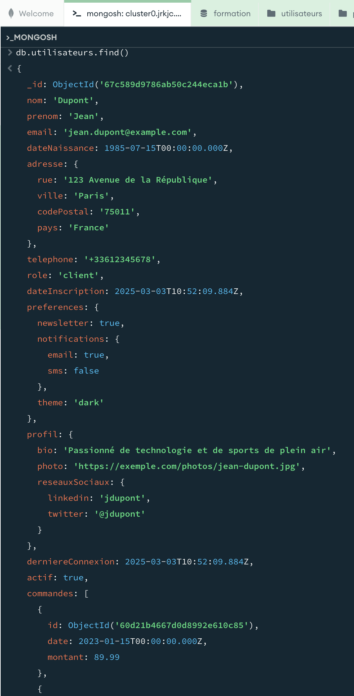
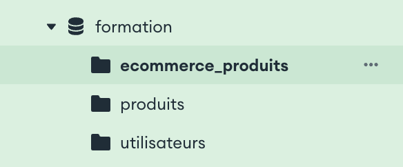
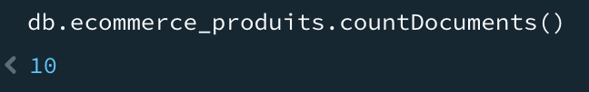
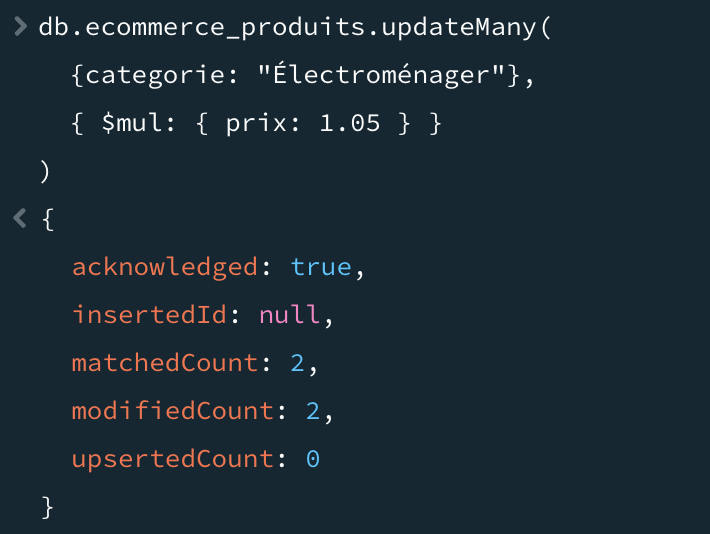

# mongo-db-b3

## Définitions :
- Index en BDD relationnelle : Sorte de drapeau qui permet de retrouver plus rapidement une information dans une table.

## Installation de MongoDB (MacOS) :
```bash
brew tap mongodb/brew
brew install mongodb-community
```

## TP1
- Ajout de données dans une collection


## TP2

### Exercice 1
- Création d'une collection



- Ajout de données dans la collection ecommerce_produits



### Exercice 2
- Récupérer tous les produits ayant la catégorie "Électroménager"
```json
db.ecommerce_produits.find({categorie: "Électroménager"})
```
- Trouver les produits ayant un prix entre 50 et 200
```json
db.ecommerce_produits.find({prix: {$gt: 50, $lt: 200}})
```
- Lister tous les produits en stock
```json
db.ecommerce_produits.find({stock: {$gt: 0}})
```
- Trouver les produits avec au moins 3 avis
```json
db.ecommerce_produits.find({commentaires: {$size: 3}})
```

### Exercice 3
- Modification de produits ayant la catégorie "Électroménager"



- Ajouter un champ promotion à certains produits

```json
db.ecommerce_produits.updateMany({prix: {$gt: 100}}, {$set: {promotion: true}})
```

- Ajouter un nouveau tag à tous les produits d'une catégorie

```json
db.ecommerce_produits.updateMany({categorie: "Électroménager"}, {$push: {tags: "nouveau_tag"}})
```

- Mettre à jour le stock après une vente

```json
db.ecommerce_produits.updateOne({nom: "Lave-linge"}, {$inc: {stock: -1}})
```

### Exercice 4

- Trouver les produits disponibles avec tag1 et tag2

```json
db.ecommerce_produits.find({tags: {$all: ["tag1", "tag2"]}})
```

- Lister les produits premium avec un stock faible

```json
db.ecommerce_produits.find({promotion: true, stock: {$lt: 5}})
```

- Rechercher les produits ayant reçu au moins un avis 5 étoiles

```json
db.ecommerce_produits.find({commentaires: {$elemMatch: {note: 5}}})
```

- Trouver les produits d'une categorie, triés par prix décroissant, limité aux 5 premiers

```json
db.ecommerce_produits.find({categorie: "Électroménager"}).sort({prix: -1}).limit(5)
```